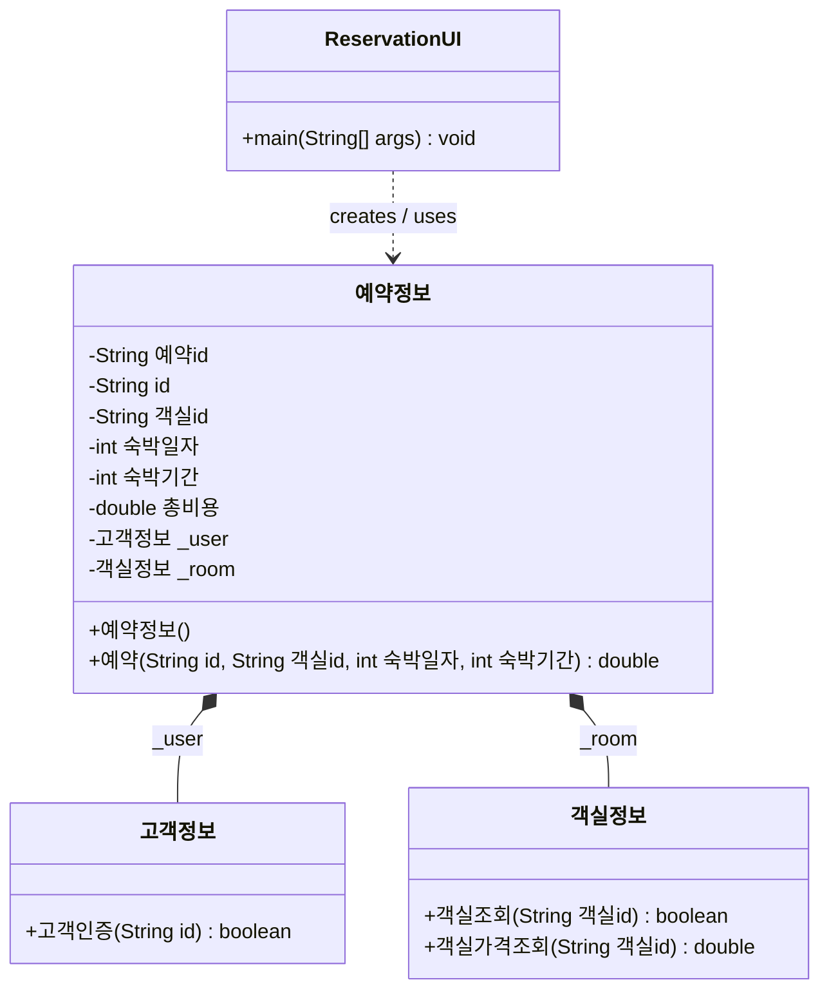

# SWDesign_B_07-002

Maven 기반 Java 웹 애플리케이션 프로젝트입니다.

## Class Diagram



## Project Structure

- `pom.xml`: Maven project configuration
- `src/main/webapp`: Web application resources
- `room`: Reservation domain classes

## Getting Started

```bash
mvn package
```

빌드 결과물은 `target/` 디렉터리에 생성됩니다.
